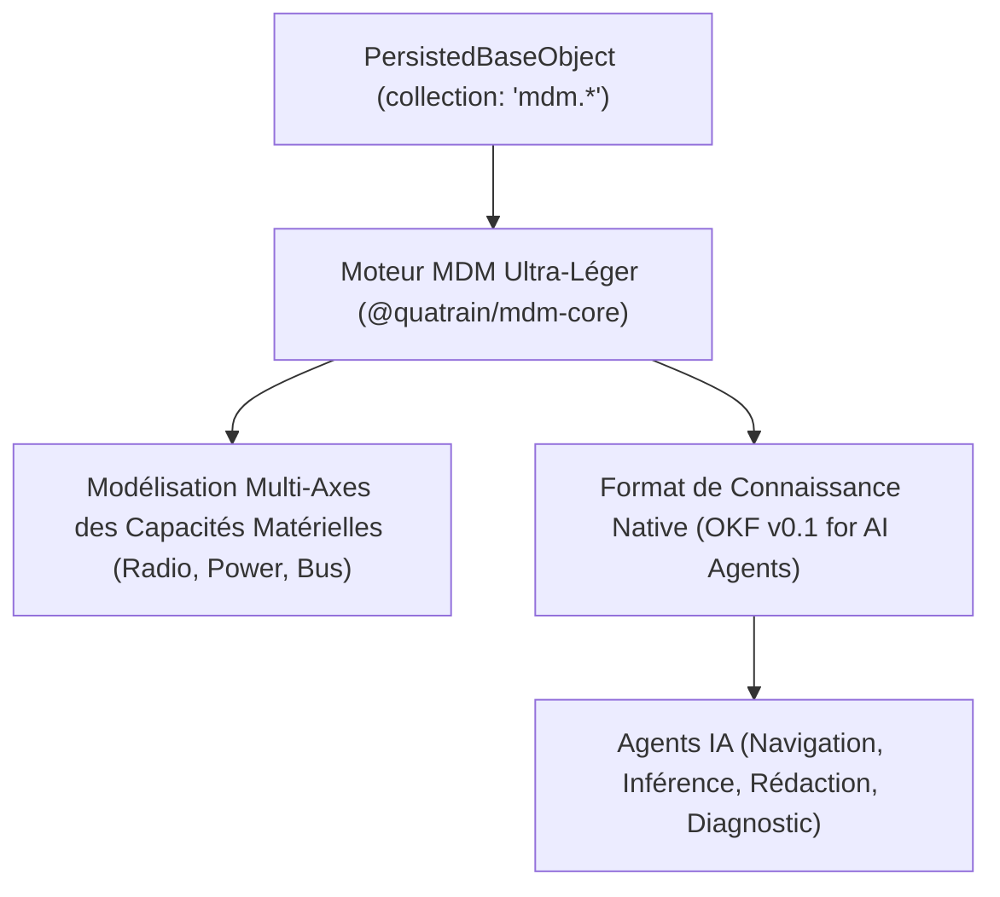
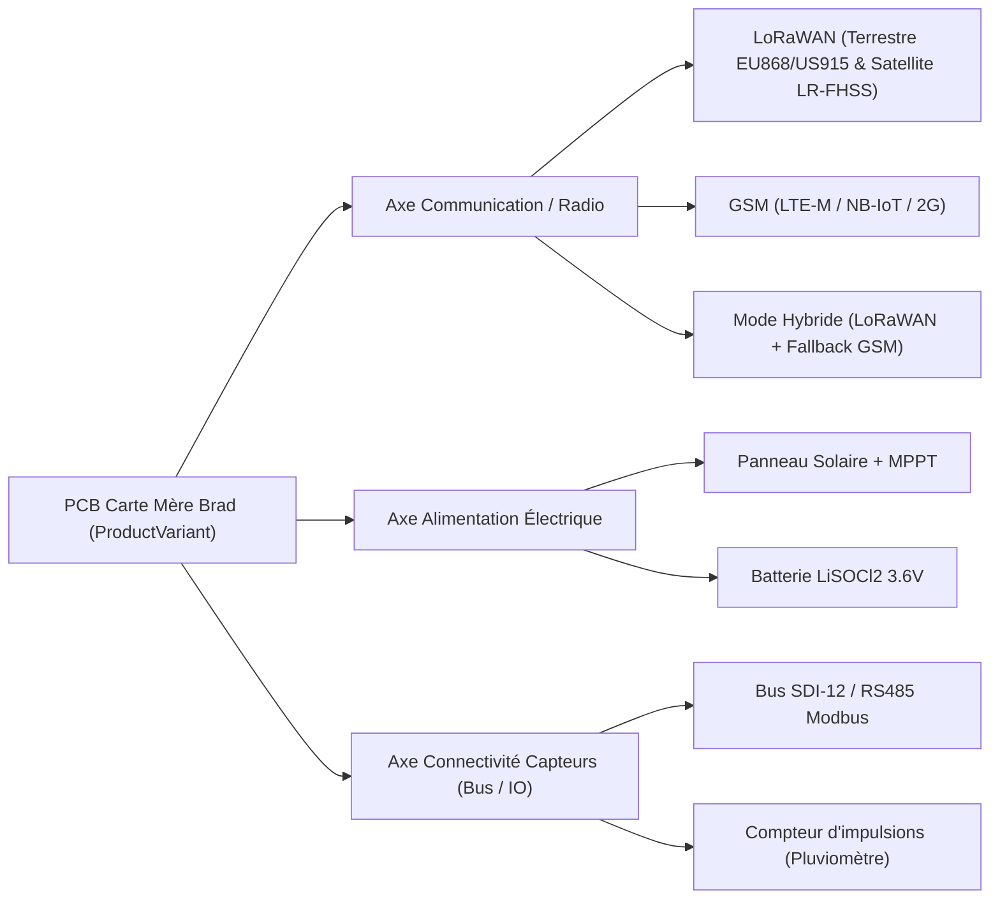
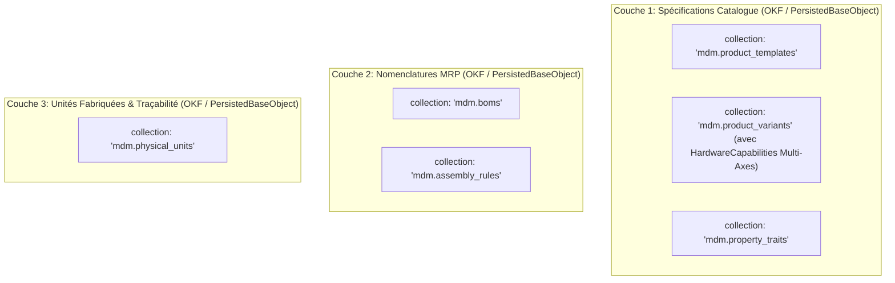

# Étude d'Architecture & Spécification : Socle Master Data Management (MDM) Agnostique (`@quatrain/mdm-*`)

Cette étude définit l'architecture conceptuelle du socle **Master Data Management (MDM)** pour l'écosystème Quatrain (`@quatrain/mdm-*`), réutilisable dans **CoreApps**.

Cette version intègre la **Modélisation Multi-Axes des Capacités Matérielles (Capabilities Matrix)** permettant de définir avec une grande souplesse les déclinaisons d'équipements embarqués (PCB Brad) combinant plusieurs axes de communication (LoRaWAN terre/satellite, GSM, hybride), d'alimentation et de connectivité capteurs.

---

## 1. Principes Fondateurs : Légèreté, Agents IA & OKF



---

## 2. Modélisation Multi-Axes des Capacités Matérielles (PCB Brad)

Pour les cartes électroniques (PCB) et équipements conçus par Brad, les spécifications ne se limitent pas à un type de communication unique, mais à une **matrice combinatoire d'axes de capacités**.



### 2.1 Définition des Axes de Capacités Matérielles (`HardwareCapabilities`)

#### 1. Axe Communication Radio (`commCapabilities`)
Support simultané ou optionnel de plusieurs piles radio sur le même PCB :
- **`lorawan_terrestrial`** : Bandes de fréquence (`EU868`, `US915`, `AS923`, `AU915`).
- **`lorawan_satellite`** : Support LoRaWAN Direct-to-Satellite (modulations S-Band / LR-FHSS).
- **`cellular_gsm`** : Technologies (`LTE-M`, `NB-IoT`, `2G/4G`), emplacements SIM (eSIM soudée, connecteur NanoSIM).
- **`hybrid_radio`** : Stratégie de bascule automatique (ex: *LoRaWAN primaire avec secours GSM si perte de réseau*).

#### 2. Axe Alimentation Électrique (`powerCapabilities`)
- **`solar_mppt`** : Entrée panneau solaire avec régulateur MPPT intégrée (puissance 1W-10W).
- **`primary_lithium`** : Pile Lithium LiSOCl2 3.6V haute capacité.
- **`rechargeable_liion`** : Accumulateur rechargeable Li-Ion / LiFePO4.
- **`external_mains`** : Bloc d'alimentation externe 12V/24V ou PoE.

#### 3. Axe Connectivité Capteurs & Bus d'E/S (`sensorBusCapabilities`)
- **`digital_buses`** : `SDI-12`, `RS485/Modbus`, `I2C`, `1-Wire`, `SPI`.
- **`analog_inputs`** : Entrées analogiques 0-10V, 4-20mA, canaux ADC haute résolution.
- **`pulse_counters`** : Entrées d'impulsions haute vitesse (anémomètre, pluviomètre).

---

## 3. Exemple OKF Enrichi : Sonde Sol / PCB Multi-Axes

Document OKF représentant une Sonde Sol Brad dotée d'un PCB hybride LoRaWAN Terrestre + Satellite + GSM :

```markdown
---
type: mdm_variant
title: "PCB Carte Mère Sonde Sol V2 - Hybrid LoRaWAN / GSM / Satellite"
description: "Carte électronique Brad intégrant les communications LoRaWAN (868MHz + Satellite LR-FHSS) et secours GSM LTE-M"
tags: ["hardware", "pcb", "lorawan", "satellite", "gsm", "brad"]
timestamp: "2026-07-26T22:00:00Z"
collection: "mdm.product_variants"
id: "dev_pcb_probe_v2_hybrid"
sku: "BRAD-PHY-PCB-HYBRID-01"
nature: "physical"
archetypeId: "device.pcb_motherboard"
lifecycleState: "production"
traitsData:
  hardwareCapabilities:
    commCapabilities:
      - technology: "lorawan_terrestrial"
        frequencyBands: ["EU868", "US915"]
        txPowerDbm: 14
      - technology: "lorawan_satellite"
        modulation: "LR-FHSS"
        constellation: "EchoStar / Wyld"
      - technology: "cellular_gsm"
        networkTypes: ["LTE-M", "NB-IoT"]
        simFormat: "eSIM_embedded"
      - strategy: "hybrid_fallback"
        primary: "lorawan_terrestrial"
        secondary: "lorawan_satellite"
        tertiary: "cellular_gsm"
    powerCapabilities:
      sources: ["solar_mppt", "primary_lithium"]
      solarMaxWattage: 5
      batteryType: "LiSOCl2_3.6V"
    sensorBusCapabilities:
      buses: ["SDI-12", "RS485_Modbus", "I2C"]
      pulseCounterChannels: 2
      analogChannels: 4
---

# PCB Carte Mère Sonde Sol V2 - Hybrid LoRaWAN / GSM / Satellite

## Spécifications Électroniques & Radios
Ce PCB constitue le cœur d'acquisition de la gamme de sondes Brad. Il dispose d'un modem multi-radio permettant une couverture réseau universelle (terrestre, satellite et cellulaire).

## Diagnostic & Directives pour Agents IA
- **Bascule de réseau** : En cas d'échec de raccordement (Join) LoRaWAN terrestre après 3 tentatives, le firmware bascule automatiquement sur le protocole Satellite LR-FHSS.
- **Vérification de la SIM** : L'eSIM embarquée utilise l'APN `brad.iot.telecom`.
```

---

## 4. Séparation des 3 Couches Applicatives DDD (MRP / PLM) en OKF / `PersistedBaseObject`



### 4.1 Modèle TypeScript des Capacités Multi-Axes (`PersistedBaseObject`)

```typescript
interface HardwareCapabilitiesTrait {
  commCapabilities: Array<{
    technology: 'lorawan_terrestrial' | 'lorawan_satellite' | 'cellular_gsm' | 'ble' | 'wifi';
    frequencyBands?: string[];    // Ex: ['EU868', 'US915']
    modulation?: string;          // Ex: 'LoRa', 'LR-FHSS'
    networkTypes?: string[];      // Ex: ['LTE-M', 'NB-IoT']
    simFormat?: string;           // Ex: 'eSIM_embedded', 'nano_sim'
  }>;
  powerCapabilities: {
    sources: Array<'solar_mppt' | 'primary_lithium' | 'rechargeable_liion' | 'external_mains'>;
    solarMaxWattage?: number;
    batteryType?: string;
  };
  sensorBusCapabilities: {
    buses: Array<'SDI-12' | 'RS485_Modbus' | 'I2C' | '1-Wire' | 'SPI'>;
    pulseCounterChannels?: number;
    analogChannels?: number;
  };
}

interface MdmProductVariant extends PersistedBaseObject {
  collection: 'mdm.product_variants';
  templateId: string;
  sku: string;
  name: string;
  nature: 'physical' | 'virtual' | 'composite';
  
  // Inclut la matrice multi-axes de capacités matérielles
  traitsData: {
    hardwareCapabilities?: HardwareCapabilitiesTrait;
    logistics?: Record<string, unknown>;
    textile?: Record<string, unknown>;
  };
  
  lifecycleState: 'rnd_concept' | 'prototype' | 'validation' | 'production' | 'maintenance' | 'end_of_life';
  validationPolicy: 'lax' | 'strict';
}
```

---

## 5. Synthèse des Bénéfices de la Modélisation Multi-Axes

1. **Souplesse de Déclinaison Produit** : Capacité à définir une carte électronique PCB unique supportant plusieurs piles radio (LoRaWAN 868MHz, LoRaWAN Satellite, GSM LTE-M) et plusieurs types d'alimentation sans multiplier inutilement les sous-archétypes.
2. **Inférence & Diagnostic par Agent IA** : Les agents IA peuvent analyser immédiatement les capacités d'un PCB (bande de fréquence, bus capteurs disponibles) pour recommander les combinaisons d'assemblage ou diagnostiquer les pannes terrain.
3. **Format Unifié `PersistedBaseObject` / OKF** : Conservation de l'extrême légèreté et de la portabilité du socle MDM Quatrain.
