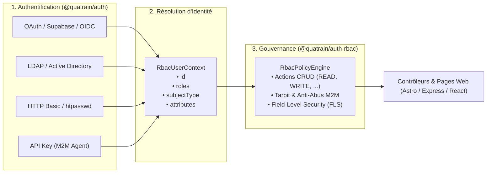

# Hands-On Workshop : Unified Auth & Fine-Grained RBAC with Quatrain

Welcome to the end-to-end integration workshop for **`@quatrain/auth-rbac`** and **`@quatrain/auth`**.

In this step-by-step tutorial, you will learn how to design a complete, production-grade authorization and authentication architecture that decouples identity providers from business permission rules.



---

## 🎯 Workshop Overview

1. **Step 1:** Declare Roles, Semantic Actions, and Field-Level Security (FLS)
2. **Step 2:** Choose & Configure an Authentication Adapter (OAuth/Supabase, LDAP, or htpasswd)
3. **Step 3:** Chain Multiple Authentication Methods (Composite Auth)
4. **Step 4:** Secure Astro SSR & Express API Routes with Automated Tarpitting
5. **Step 5:** Enforce Micro-Security on Data Payloads (`sanitizeRead` & `sanitizeWrite`)
6. **Step 6:** Implement Visual UI Component Guards in Frontend Views

---

## 🛠️ Step 1: Declare Roles, Semantic Actions & FLS

Create `src/security/roles.ts` to define your application's security policies:

```typescript
import { RbacPolicyEngine, type RoleDefinition } from '@quatrain/auth-rbac'

export const appRoles: RoleDefinition[] = [
  // 1. Anonymous Public Visitor
  {
    id: 'anonymous',
    name: 'Anonymous Visitor',
    routes: [
      { pattern: '/public/**', actions: ['READ'], access: 'allow' },
      { pattern: '/login', actions: ['*'], access: 'allow' },
      { pattern: '/**', actions: ['*'], access: 'deny' }
    ]
  },

  // 2. Authenticated Reader
  {
    id: 'reader',
    name: 'Standard Reader',
    inherits: ['anonymous'],
    routes: [
      { pattern: '/api/documents/**', actions: ['READ'], access: 'allow' },
      { pattern: '/dashboard/**', actions: ['READ'], access: 'allow' }
    ],
    entities: {
      'document': {
        defaultMode: 'readonly',
        fields: {
          internalReviewerNotes: 'hidden', // Field stripped on read
          draftHistory: 'hidden'
        }
      }
    }
  },

  // 3. Curator
  {
    id: 'curator',
    name: 'Content Curator',
    inherits: ['reader'],
    routes: [
      { pattern: '/api/documents/**', actions: ['READ', 'WRITE', 'UPDATE'], access: 'allow' },
      { pattern: '/api/upload', actions: ['WRITE'], access: 'allow' }
    ],
    entities: {
      'document': {
        defaultMode: 'readwrite',
        fields: {
          soa: 'readonly', // Cannot be overwritten by Curator
          publishedAt: 'readonly',
          internalReviewerNotes: 'readwrite'
        }
      }
    }
  },

  // 4. Autonomous AI Agent / M2M Service
  {
    id: 'ai-agent',
    name: 'Autonomous AI Crawler',
    subjectTypes: ['agent', 'service'],
    routes: [
      { pattern: '/api/ingest/**', actions: ['WRITE', 'EXECUTE'], access: 'allow' }
    ],
    tarpit: {
      enabled: true,
      burst: 5,
      maxRequestsPerMinute: 30,
      delayMs: 500, // Injected delay per consecutive violation
      blockDurationMs: 60000 // 1-minute lockout on abusive polling
    }
  }
]

export const rbacEngine = new RbacPolicyEngine(appRoles)
```

---

## 🔐 Step 2: Connect an Authentication Adapter

Authentication adapters answer *"Who is the subject?"*, while `@quatrain/auth-rbac` evaluates *"What is this subject allowed to do?"*.

Choose the adapter that matches your infrastructure:

### Option A: Supabase / OAuth 2.0 / OpenID Connect

```typescript
import { SupabaseAuthAdapter } from '@quatrain/auth-supabase'
import type { RbacUserContext } from '@quatrain/auth-rbac'

export const authAdapter = new SupabaseAuthAdapter({
  config: {
    supabaseUrl: process.env.SUPABASE_URL,
    supabaseKey: process.env.SUPABASE_ANON_KEY
  }
})

// Custom identity resolver bridging Supabase token to RbacUserContext
export async function resolveSupabaseUser(req: any): Promise<RbacUserContext | null> {
  const token = req.headers?.authorization?.replace('Bearer ', '') || req.cookies?.['sb-access-token']
  if (!token) return null

  try {
    const { data } = await authAdapter.client.auth.getUser(token)
    if (!data?.user) return null

    return {
      id: data.user.id,
      roles: data.user.app_metadata?.roles || [data.user.app_metadata?.role || 'reader'],
      subjectType: data.user.app_metadata?.subjectType || 'human',
      attributes: {
        email: data.user.email,
        name: data.user.user_metadata?.full_name
      }
    }
  } catch {
    return null
  }
}
```

### Option B: HTTP Basic / .htpasswd (Legacy or Edge systems)

```typescript
import { HttpBasicAuthAdapter } from '@quatrain/auth-http-basic'
import type { RbacUserContext } from '@quatrain/auth-rbac'

export const basicAuth = new HttpBasicAuthAdapter({
  config: { htpasswdPath: '/etc/nginx/.htpasswd' }
})

export async function resolveBasicUser(req: any): Promise<RbacUserContext | null> {
  const authHeader = req.headers?.authorization
  if (!authHeader?.startsWith('Basic ')) return null

  const user = await basicAuth.authenticateHeader(authHeader)
  if (!user) return null

  return {
    id: user.username,
    roles: user.roles || ['reader'],
    subjectType: 'human'
  }
}
```

---

## 🔗 Step 3: Chain Multi-Provider Authentication (Composite Auth)

For architectures requiring dual-stack authentication (e.g. Bearer OAuth for humans + API Key for autonomous M2M AI Agents):

```typescript
import type { RbacUserContext } from '@quatrain/auth-rbac'

export async function compositeUserResolver(req: any): Promise<RbacUserContext | null> {
  // 1. Try M2M API Key header first
  const apiKey = req.headers?.['x-api-key']
  if (apiKey) {
    if (apiKey === process.env.AGENT_SECRET_KEY) {
      return {
        id: 'gemini-agent-worker-01',
        roles: ['ai-agent'],
        subjectType: 'agent',
        attributes: { model: 'gemini-2.5-pro' }
      }
    }
  }

  // 2. Fallback to Supabase OAuth Session
  return await resolveSupabaseUser(req)
}
```

---

## 🚀 Step 4: Secure Astro SSR & Express API Routes

### In Astro SSR (`src/middleware.ts`):

```typescript
import { sequence } from 'astro:middleware'
import { AstroRbacMiddleware } from '@quatrain/auth-rbac'
import { rbacEngine } from './security/roles'
import { compositeUserResolver } from './security/auth'

const rbacMiddleware = new AstroRbacMiddleware(rbacEngine, {
  userResolver: compositeUserResolver,
  loginRedirectPath: '/login',
  forbiddenRedirectPath: '/403',
  enableTarpitSleep: true // Injects progressive latency on abusive subjects
})

export const onRequest = sequence(rbacMiddleware.handler())
```

---

## 🛡️ Step 5: Enforce Micro-Security on Data Payloads (FLS)

Inside an API Endpoint (`src/pages/api/documents/[id].ts`):

```typescript
import type { APIRoute } from 'astro'

export const GET: APIRoute = async ({ params, locals }) => {
  const rbac = locals.rbac // Injected automatically by AstroRbacMiddleware

  // Fetch full document from DB
  const rawDocument = await db.documents.findUnique({ where: { id: params.id } })

  // Sanitize outgoing read payload: automatically strips 'hidden' fields
  const safeData = rbac.sanitizeRead('document', rawDocument)

  return new Response(JSON.stringify(safeData), {
    headers: { 'Content-Type': 'application/json' }
  })
}

export const PUT: APIRoute = async ({ request, locals }) => {
  const rbac = locals.rbac
  const incomingPayload = await request.json()

  // Sanitize incoming write payload: automatically strips 'readonly' & 'hidden' fields
  const validatedData = rbac.sanitizeWrite('document', incomingPayload)

  const updated = await db.documents.update({ data: validatedData })
  return new Response(JSON.stringify(updated))
}
```

---

## 🎨 Step 6: Visual UI Component Guards in React

In your React / Mantine UI components:

```tsx
import React from 'react'

interface DocumentEditorProps {
  document: any
  rbacContext: {
    isFieldEditable: (entity: string, prop: string) => boolean
    isFieldVisible: (entity: string, prop: string) => boolean
  }
}

export function DocumentEditor({ document, rbacContext }: DocumentEditorProps) {
  return (
    <form>
      <input defaultValue={document.title} />

      {/* Field visible only to authorized roles */}
      {rbacContext.isFieldVisible('document', 'internalReviewerNotes') && (
        <textarea
          defaultValue={document.internalReviewerNotes}
          disabled={!rbacContext.isFieldEditable('document', 'internalReviewerNotes')}
          placeholder="Internal notes for curators only"
        />
      )}

      {/* Read-only field for non-admins */}
      <input
        defaultValue={document.soa}
        disabled={!rbacContext.isFieldEditable('document', 'soa')}
      />
    </form>
  )
}
```

---

## 📚 Summary Checklist

| Layer | Component | Responsibility |
| :--- | :--- | :--- |
| **Authentication** | `AbstractAuthAdapter` | Resolves subject identity (OAuth, LDAP, Basic, API Key). |
| **Identity Contract** | `RbacUserContext` | Immutable subject payload (`id`, `roles`, `subjectType`). |
| **Macro-Security** | `RbacPolicyEngine` | Evaluates route paths (`/api/**`) and semantic actions (`READ`, `WRITE`). |
| **Anti-Abuse** | `TarpitManager` | Throttles and injects latency on rogue AI agents / M2M scripts. |
| **Micro-Security** | Field-Level Security | Strips/protects fields (`hidden`, `readonly`, `readwrite`). |
