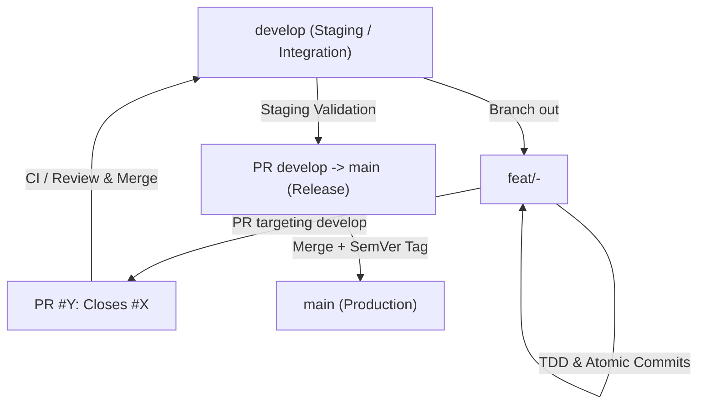

# Quatrain Core - Framework Contributing Guidelines (AI & Developer Guide)

This document outlines the strict workflow guidelines, code quality compliance standards, and architectural rules for AI agents and developers contributing directly to the **Quatrain Core monorepo codebase** (packages, containers, applications, and CI/CD).

**When modifying, adding, or fixing packages inside this repository, you MUST follow these standards.**

---

## 1. Monorepo Workflow & Compilation

All package modifications must align with workspace topological rules and compilation integrity guidelines.

### A. Zero TypeScript Errors Policy
- A development task, refactor, or fix is **NEVER** considered finished until the TypeScript compiler (`tsc`) passes successfully across all scopes without a single error or warning.
- **Unused Imports (TS6133):** You must strictly verify and remove all unused imports, variables, or types before declaring a task complete. Unused variables are treated as errors and will break the CI/CD pipeline.

### B. Verification inside Packages
- Before committing, always verify compile-correctness locally within the package you are working on to isolate errors:
  ```bash
  cd packages/<package-name>
  npx tsc -p tsconfig.json
  ```
- *Note:* In restricted sandboxes, you can safely ignore `EPERM` write warnings on `dist/` or `.tsbuildinfo` as long as there are **zero syntax or type errors** (e.g. `TS2345`).

### C. Monorepo Workspace Dependencies
- Internal dependencies between monorepo packages in their `package.json` MUST be declared using the `"workspace:*"` version flag. This ensures build tools establish correct compilation graphs.
- **NPM Provenance Repository Block:** Every new package `package.json` MUST contain a valid `repository` block. If omitted, secure releases will fail during the publication pipeline.
  ```json
  "repository": {
    "type": "git",
    "url": "git+https://github.com/Quatrain/Core.git",
    "directory": "packages/<package-name>"
  }
}
```

---

## 2. Test Structure & Publishing Cleanliness

To support native Bun and Deno environments, Quatrain distributes both `dist/` and raw `src/` files. We must prevent test bloat in published packages.

- **Co-locate Unit Tests:** Keep unit tests (`*.test.ts` or `*.spec.ts`) directly next to their implementation source files inside the `src/` directory (e.g. `src/MyService.test.ts`).
- **Group Integration Tests:** Group integration or end-to-end tests in dedicated directories outside `src/` (such as `tests/` or `__tests__/` at the package root level).
- **Exclude Tests on Publish:** Every package MUST explicitly exclude test files, configurations, and mocks from the published registry bundle using `package.json` files whitelist and `.npmignore`:
  ```ignore
  # .npmignore
  **/*.test.ts
  **/*.spec.ts
  **/__tests__/
  **/tests/
  **/mocks/
  jest.config.js
  ```

---

## 3. SonarQube & Code Quality Compliance Rules

To satisfy modern static code analyzers like SonarQube, always enforce the following code quality rules:

### A. Number Utilities & Strict Casting
- **Prefer `Number.parseInt` over `parseInt`**: Always specify the radix explicitly.
  - ❌ **BAD:** `parseInt(value)`
  - ✅ **GOOD:** `Number.parseInt(value, 10)`
- **Prefer `Number.isNaN` over `isNaN`**: Avoid implicit type coercion issues.
  - ❌ **BAD:** `isNaN(value)`
  - ✅ **GOOD:** `Number.isNaN(value)`

### B. Interactive Elements & HTML5 Accessibility (`typescript:S6848`)
- Non-interactive DOM elements (e.g. `<div>`, `<span>`, `<td>`) should never have interactive event handlers (like `onClick` or `onKeyDown`) unless they are converted to appropriate native interactive elements (like `<button>`).
- If a non-native element must be used, add the appropriate WAI-ARIA `role`, a valid `tabIndex={0}`, and ensure complete support for tabbing, mouse, keyboard, and touch inputs.

### C. Default Parameters & Object Literals (`typescript:S7737`)
- Never use an object literal as a default parameter value in function or method signatures (e.g., `params: object = {}`).
- *Why*: Creating a new object reference on every invocation causes memory overhead, breaks React memoization, and is flagged by static code analyzers.
- *The Fix*: Make the parameter optional (e.g. `params?: object`) or default to `undefined`, then initialize a fallback inside the function body:
  ```typescript
  // ✅ GOOD:
  public async get(endpoint: string, params?: QueryOptions) {
     const actualParams = params || {}
     // ...
  }
  ```

---

## 4. Security & Process Rigor

- **Secure Process Execution (`shell: false`):** When invoking Node.js `child_process` methods (`spawn`, `exec`, `spawnSync`), you MUST explicitly set `{ shell: false }` to prevent shell injection vulnerabilities.
- **Defensive Scripts:** CI, publishing, and build scripts must be highly defensive. Validate variables, check directory existence before operations, catch file-handling exceptions, and avoid hardcoded codebase fallback values (e.g. explicitly define all infrastructure environment keys in Kubernetes config maps rather than falling back silently).

---

## 5. Logging & JSDoc Standards

- **Deprecated Logging:** `Backend.log()` is deprecated. Do not use it.
- **Log Severity Levels:** Use explicit levels written in **International English**:
  - `Backend.debug('...')`: For traceability.
  - `Backend.info('...')`: For normal system operations.
  - `Backend.warn('...')`: For abnormal non-blocking events.
  - `Backend.error('...')`: For captured critical exceptions.
- **JSDoc Requirements:** Every new class, function, or method MUST be accompanied by a comprehensive JSDoc block detailing its purpose, `@param` inputs, and `@returns` output.

---

## 6. GitFlow & Contribution Lifecycle (AGENTS.okf Standard)

All contributions to the Quatrain Core monorepo follow the GitFlow lifecycle defined in [AGENTS.okf](file:///Users/crapougnax/CODE/CRAPOUGNAX/AGENTS.okf/content/workflow/gitflow-protocol.md):



### Protocol Summary:
1. **Integration Branch (`develop`):** The default branch for active integration, tests, and preview releases.
2. **Branching:** Feature and bugfix branches must branch out strictly from `develop`:
   ```bash
   git checkout develop && git pull origin develop
   git checkout -b feat/<issue-number>-<short-description>
   ```
3. **Pull Requests:** Open PRs targeting `--base develop` with explicit metadata:
   ```bash
   gh pr create --base develop --head feat/<branch> --assignee @me --title "..." --body "Closes #<issue-number>"
   ```
4. **Production Releases (`develop` $\to$ `main`):** Formal release PRs merge from `develop` into `main` with annotated SemVer tags.

