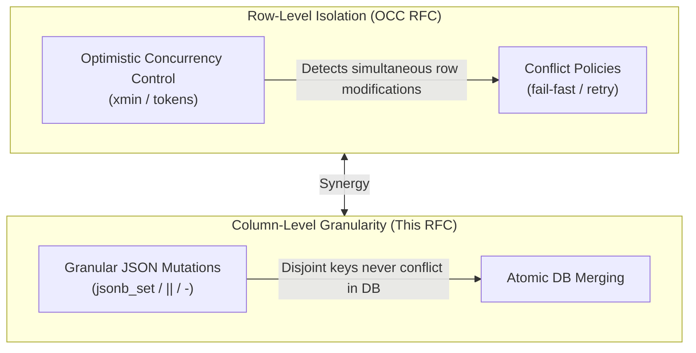

# RFC: Granular JSON Key-by-Key Mutations & Partial Updates in Quatrain Backends

**Status:** Draft / Architecture Specification  
**Scope:** `@quatrain/core`, `@quatrain/backend`, `@quatrain/backend-postgres`, `@quatrain/backend-firestore`, `@quatrain/backend-sqlite`  
**Author:** Quatrain Architecture Team  
**Date:** September 2026  
**Companion RFC:** [RFC: Abstract Optimistic Concurrency Control (OCC) & Conflict Resolution](./RFC_OPTIMISTIC_CONCURRENCY_CONTROL.md)  

---

## 1. Executive Summary & Problem Statement

In the Quatrain framework, unstructured and semi-structured schema attributes are modeled using `MapProperty` (and `HashProperty`). Under the hood, modern relational backends such as PostgreSQL store these columns as `JSONB`, while document databases like Cloud Firestore or MongoDB store them as native sub-documents.

### The Monolithic Serialization Problem

Currently, both `@quatrain/core` and database adapters handle `MapProperty` values **monolithically**:

1. When any key inside a `MapProperty` changes, the entire property is flagged as `_changed = true`.
2. On persistence, `dataObject.toJSON({ ignoreUnchanged: true })` serializes the entire nested object via `JSON.stringify(value)`.
3. The database adapter generates a full-column replacement:
   ```sql
   -- Current PostgresAdapter output:
   UPDATE "media" SET metadata = $1 WHERE id = $2;
   -- where $1 contains the entire 50KB JSON payload
   ```

### Real-World Pain Points

1. **Destructive Concurrent Overwrites in Worker Pipelines:**
   - **Worker A** (video transcoder) finishes encoding and writes: `metadata.transcoding = { status: 'DONE', width: 1920, height: 1080 }`.
   - **Worker B** (AI speech-to-text) finishes transcription and writes: `metadata.audio = { transcript: '...', language: 'fr' }`.
   - **Worker C** removes a temporary upload ticket: `delete metadata.uploadTicket`.
   - **Result:** Whichever worker commits last completely wipes out the updates made by the other workers, unless heavy row-level locking or optimistic locks with complex 3-way merge algorithms are used.

2. **Network and Write-Ahead Log (WAL) Bloat:**
   - Updating a single boolean flag or timestamp in a 100KB JSON payload requires re-transmitting and re-writing the entire 100KB to the database engine, generating excessive I/O and PostgreSQL WAL traffic.

3. **Parity Gap with Modern Document Stores:**
   - Systems like Google Cloud Firestore provide first-class partial updates (`updateDoc` with dot-notation like `"metadata.author": "Alice"`) and atomic deletion (`FieldValue.delete()`). Developers expect equivalent ergonomics and database-level atomicity in Quatrain.

---

## 2. Goals & Architectural Vision

This RFC defines:
1. **Engine-Agnostic Mutation Primitives:** Sentinel values (`FieldValue.delete()`, `FieldValue.increment()`) and dot-notation path semantics in `@quatrain/core`.
2. **Delta Tracking on `MapProperty`:** Efficient in-memory tracking of added, updated, and deleted keys so that `dataObject.save()` automatically emits minimal mutation deltas.
3. **Multi-Engine Compilation:** Translating abstract deltas into native, high-performance database primitives:
   - **PostgreSQL:** Native `JSONB` operators (`||`, `-`, `#-`, `jsonb_set`, and Postgres 14+ subscripts).
   - **Cloud Firestore:** Field path updates and `FieldValue.delete()`.
   - **SQLite:** `json_patch()` and `json_remove()`.
   - **MongoDB:** `$set`, `$unset`, and `$inc`.
4. **Symbiosis with Optimistic Concurrency Control (OCC):** Complementing the OCC specification by reducing write-conflict rates to near-zero when workers touch disjoint keys.

---

## 3. Abstract Mutation Model (`@quatrain/core` & `@quatrain/backend`)

```mermaid
classDiagram
    class FieldValue {
        <<sentinel>>
        +delete() FieldValueSentinel
        +increment(n: number) FieldValueSentinel
        +arrayUnion(...elements) FieldValueSentinel
        +arrayRemove(...elements) FieldValueSentinel
    }

    class JsonMutationDelta {
        +set: Record~string, any~
        +unset: string[]
        +deepSet: Array~{ path: string[], value: any }~
        +deepUnset: Array~{ path: string[] }~
        +isEmpty(): boolean
    }

    class MapProperty {
        -_value: Record~string, any~
        -_delta: JsonMutationDelta
        +setKey(key: string, value: any): this
        +deleteKey(key: string): this
        +setPath(path: string[], value: any): this
        +deletePath(path: string[]): this
        +getDelta(): JsonMutationDelta
        +clearDelta(): void
    }

    class AbstractBackendAdapter {
        <<abstract>>
        +update(dataObject: DataObjectClass, options?: AdapterUpdateOptions): Promise~DataObjectClass~
        +patch(uri: ObjectUri, patch: Record~string, any~, options?: AdapterUpdateOptions): Promise~void~
    }

    MapProperty --> JsonMutationDelta : accumulates
    AbstractBackendAdapter ..> FieldValue : interprets sentinels
```

### A. Sentinel Values (`FieldValue`)

Sentinels signal special database-level operations rather than literal scalar assignments:

```typescript
export enum SentinelType {
   DELETE = 'DELETE',
   INCREMENT = 'INCREMENT',
   ARRAY_UNION = 'ARRAY_UNION',
   ARRAY_REMOVE = 'ARRAY_REMOVE',
}

export class FieldValueSentinel {
   constructor(
      public readonly type: SentinelType,
      public readonly payload?: any
   ) {}
}

export class FieldValue {
   /** Remove a specific key or path without overwriting the parent container */
   static delete(): FieldValueSentinel {
      return new FieldValueSentinel(SentinelType.DELETE)
   }

   /** Atomically increment a numerical counter in the database */
   static increment(n: number): FieldValueSentinel {
      return new FieldValueSentinel(SentinelType.INCREMENT, n)
   }

   /** Append elements to a JSON array if not already present */
   static arrayUnion(...elements: any[]): FieldValueSentinel {
      return new FieldValueSentinel(SentinelType.ARRAY_UNION, elements)
   }

   /** Remove elements from a JSON array */
   static arrayRemove(...elements: any[]): FieldValueSentinel {
      return new FieldValueSentinel(SentinelType.ARRAY_REMOVE, elements)
   }
}
```

### B. Delta Tracking in `MapProperty`

Rather than only tracking a single boolean `_changed`, `MapProperty` records discrete key mutations:

```typescript
export interface JsonMutationDelta {
   /** Top-level keys to merge / overwrite */
   set: Record<string, any>
   /** Top-level keys to delete */
   unset: string[]
   /** Nested paths to update: { path: ['settings', 'email'], value: true } */
   deepSet: Array<{ path: string[]; value: any }>
   /** Nested paths to remove: { path: ['settings', 'legacyToken'] } */
   deepUnset: Array<{ path: string[] }>
}

export class MapProperty extends BaseProperty {
   static TYPE = 'map'

   protected _delta: JsonMutationDelta = {
      set: {},
      unset: [],
      deepSet: [],
      deepUnset: [],
   }

   /** Set or update a top-level key */
   public setKey(key: string, value: any): this {
      this._value = this._value || {}
      this._value[key] = value
      this._delta.set[key] = value
      this._delta.unset = this._delta.unset.filter((k) => k !== key)
      this._changed = true
      return this
   }

   /** Remove a top-level key */
   public deleteKey(key: string): this {
      if (this._value && Reflect.has(this._value, key)) {
         delete this._value[key]
      }
      if (!this._delta.unset.includes(key)) {
         this._delta.unset.push(key)
      }
      delete this._delta.set[key]
      this._changed = true
      return this
   }

   /** Return accumulated delta and check if mutation is present */
   public getDelta(): JsonMutationDelta {
      return this._delta
   }

   public clearDelta(): void {
      this._delta = { set: {}, unset: [], deepSet: [], deepUnset: [] }
   }
}
```

---

## 4. Multi-Engine Adaptation Matrix

| Storage Engine | Add / Update Top Keys | Key Removal | Deep Nested Path Update | Deep Path Deletion |
| :--- | :--- | :--- | :--- | :--- |
| **PostgreSQL (`JSONB`)** | `col = COALESCE(col, '{}'::jsonb) \|\| $payload::jsonb` | `col = col - $key`<br/>`col = col - $keys_array::text[]` | `jsonb_set(col, '{a,b}', $val::jsonb, true)`<br/>or `col['a']['b'] = $val` (PG 14+) | `col = col #- '{a,b}'` |
| **Google Cloud Firestore** | `updateDoc({ 'col.key': val })` | `updateDoc({ 'col.key': FieldValue.delete() })` | `updateDoc({ 'col.a.b': val })` | `updateDoc({ 'col.a.b': FieldValue.delete() })` |
| **SQLite (3.38+ JSON)** | `col = json_patch(COALESCE(col, '{}'), $json_obj)` | `col = json_remove(col, '$.key')` | `col = json_set(col, '$.a.b', $val)` | `col = json_remove(col, '$.a.b')` |
| **MongoDB** | `$set: { 'col.key': val }` | `$unset: { 'col.key': '' }` | `$set: { 'col.a.b': val }` | `$unset: { 'col.a.b': '' }` |

---

## 5. Deep-Dive: PostgreSQL Implementation (`PostgresAdapter`)

PostgreSQL offers exceptional performance for JSONB operations, executing in-place binary transformations without full record roundtrips.

### A. SQL Compilation Rules for Granular Mutations

When `PostgresAdapter.update()` or `PostgresAdapter.patch()` processes a `MapProperty` with an active delta:

#### Scenario 1: Combined Add/Update & Removal on Top-Level Keys
When both additions/updates and removals occur on the same column:
```sql
UPDATE "media"
SET 
   metadata = (COALESCE(metadata, '{}'::jsonb) || $1::jsonb) - $2::text[],
   updated_at = NOW()
WHERE id = $3;
```
- `$1`: `'{"transcoding": {"status": "DONE"}, "processedBy": "worker-42"}'`
- `$2`: `'{"uploadTicket", "tempPath"}'` (PostgreSQL `text[]` array)

#### Scenario 2: Nested Path Mutations (`jsonb_set`)
When nested paths are updated:
```sql
UPDATE "media"
SET metadata = jsonb_set(
   COALESCE(metadata, '{}'::jsonb),
   '{transcoding,progress}',
   '100'::jsonb,
   true -- create missing path elements
)
WHERE id = $1;
```

#### Scenario 3: Multiple Path Deletions (`#-`)
```sql
UPDATE "media"
SET metadata = metadata #- '{transcoding,tempDetails}' #- '{flags,experimental}'
WHERE id = $1;
```

### B. Implementation in `PostgresAdapter`

```typescript
// Inside PostgresAdapter.ts
private _compileJsonbUpdate(
   columnName: string,
   delta: JsonMutationDelta,
   values: any[],
   paramIndex: { current: number }
): string {
   let expr = `COALESCE("${columnName}", '{}'::jsonb)`

   // 1. Apply shallow additions / updates
   if (Object.keys(delta.set).length > 0) {
      const idx = paramIndex.current++
      values.push(JSON.stringify(delta.set))
      expr = `(${expr} || $${idx}::jsonb)`
   }

   // 2. Apply shallow removals
   if (delta.unset.length > 0) {
      const idx = paramIndex.current++
      values.push(delta.unset)
      expr = `(${expr} - $${idx}::text[])`
   }

   // 3. Apply deep path updates
   for (const { path, value } of delta.deepSet) {
      const valIdx = paramIndex.current++
      values.push(typeof value === 'string' ? JSON.stringify(value) : JSON.stringify(value))
      const pathArray = `{${path.join(',')}}`
      expr = `jsonb_set(${expr}, '${pathArray}', $${valIdx}::jsonb, true)`
   }

   // 4. Apply deep path removals
   for (const { path } of delta.deepUnset) {
      const pathArray = `{${path.join(',')}}`
      expr = `(${expr} #- '${pathArray}')`
   }

   return `"${columnName}" = ${expr}`
}
```

### C. Direct Patch API (`PostgresAdapter.patch`)

In addition to stateful `DataObject.save()`, a direct headless `patch()` method avoids hydrating objects:

```typescript
async patch(
   uri: ObjectUri,
   payload: Record<string, any>,
   options?: AdapterUpdateOptions
): Promise<void> {
   const collection = uri.collection?.toLowerCase()
   const uid = uri.resource
   const updates: string[] = []
   const values: any[] = []
   const paramIndex = { current: 1 }

   for (const [key, value] of Object.entries(payload)) {
      if (key.includes('.')) {
         // Dot notation: e.g. "metadata.transcoding.status"
         const [col, ...path] = key.split('.')
         if (value instanceof FieldValueSentinel && value.type === SentinelType.DELETE) {
            const pathArray = `{${path.join(',')}}`
            updates.push(`"${col}" = COALESCE("${col}", '{}'::jsonb) #- '${pathArray}'`)
         } else {
            const valIdx = paramIndex.current++
            values.push(JSON.stringify(value))
            const pathArray = `{${path.join(',')}}`
            updates.push(`"${col}" = jsonb_set(COALESCE("${col}", '{}'::jsonb), '${pathArray}', $${valIdx}::jsonb, true)`)
         }
      } else if (value instanceof FieldValueSentinel && value.type === SentinelType.DELETE) {
         // Full column nullification
         updates.push(`"${key.toLowerCase()}" = NULL`)
      } else {
         // Regular scalar assignment
         const valIdx = paramIndex.current++
         values.push(value)
         updates.push(`"${key.toLowerCase()}" = $${valIdx}`)
      }
   }

   values.push(uid)
   const idIdx = paramIndex.current++

   const query = `UPDATE "${collection}" SET ${updates.join(', ')} WHERE id = $${idIdx};`
   await this._query(query, values)
}
```

---

## 6. Developer Experience & API Patterns

### Pattern 1: Dot-Notation Patching (Firebase / Firestore Paradigm)

Ideal for microservices, webhooks, and background event processors:

```typescript
// Direct repository patch without full model load
await mediaRepository.patch(mediaId, {
   'metadata.transcoding.status': 'DONE',
   'metadata.transcoding.resolution': { width: 3840, height: 2160 },
   'metadata.uploadTicket': FieldValue.delete(),
   status: statuses.COMPLETED,
})
```

### Pattern 2: Entity-Level Key Mutation

Natural object-oriented syntax within domain entities:

```typescript
const media = await mediaRepository.read(mediaId)

// Granular updates inside the MapProperty
media.metadata.setKey('lastAuditedAt', Date.now())
media.metadata.deleteKey('temporaryAuthToken')

// Only the delta (set: lastAuditedAt, unset: temporaryAuthToken) is sent to PostgreSQL!
await media.save()
```

### Pattern 3: Atomic Numeric Counters & Queue Workers

```typescript
// Increment job retry counter atomically in JSONB without race conditions
await taskRepository.patch(taskId, {
   'metadata.attempts': FieldValue.increment(1),
   'metadata.lastError': 'Connection timed out',
})
```

---

## 7. Synergy with the OCC Specification (Companion RFC)

The two RFCs address complementary levels of concurrency:



1. **Elimination of False Conflicts:**  
   When two workers update different keys in the same `JSONB` column, granular SQL mutations allow both writes to succeed cleanly at the database engine level.
2. **Simplified Retry Logic:**  
   In the event that an OCC retry is triggered (e.g. status was modified simultaneously), an atomic mutation delta can simply be re-applied against the fresh state without requiring complex three-way object tree diffing.

---

## 8. Migration Plan & Rollout

### Phase 1: Core Definitions (`@quatrain/core`)
- Add `FieldValue` and `FieldValueSentinel` classes.
- Enrich `MapProperty` with `setKey()`, `deleteKey()`, `setPath()`, and delta tracking.
- Add comprehensive unit test suite in `MapProperty.test.ts`.

### Phase 2: PostgreSQL Adapter Implementation (`@quatrain/backend-postgres`)
- Implement `_compileJsonbUpdate()` in `PostgresAdapter.ts`.
- Implement `patch()` with dot-notation and sentinel handling in `PostgresAdapter.ts`.
- Integration tests validating `||`, `-`, `#-`, and `jsonb_set` queries against PostgreSQL 15+.

### Phase 3: Secondary Backends (`@quatrain/backend-firestore` & `@quatrain/backend-sqlite`)
- Wire `patch()` and sentinels to Google Cloud Firestore's native `FieldValue.delete()`.
- Implement SQLite `json_patch()` and `json_remove()` in `SqliteAdapter.ts`.

### Phase 4: High-Level Repository Integration (`@quatrain/backend`)
- Expose `patch(uid, partialPayload)` on `BaseRepository`.
- Validate zero-regression on existing monolithic `save()` and `update()` pipelines.
