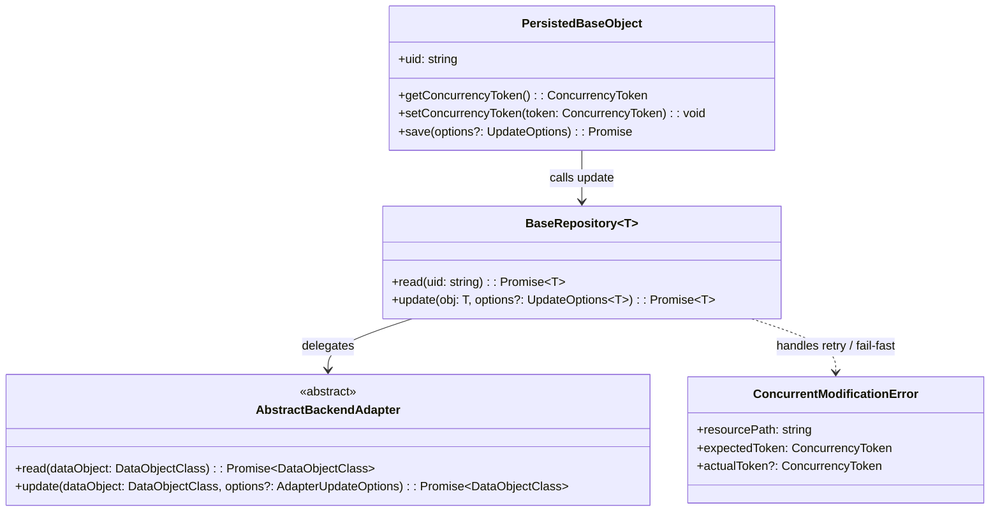
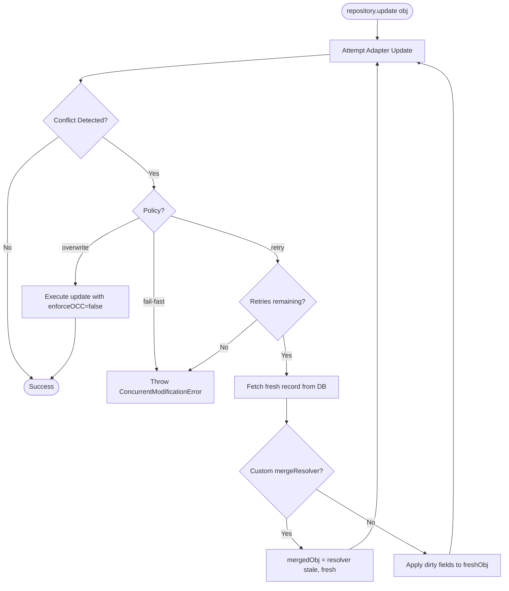

# RFC: Abstract Optimistic Concurrency Control (OCC) & Conflict Resolution in Quatrain Core

**Status:** Draft / Architecture Specification  
**Scope:** `@quatrain/core`, `@quatrain/backend`, `@quatrain/backend-postgres`, `@quatrain/backend-firestore`, `@quatrain/backend-sqlite`  
**Author:** Totalymage & Quatrain Architecture Team  
**Date:** September 2026  
**Companion RFC:** [RFC: Granular JSON Key-by-Key Mutations & Partial Updates](./RFC_GRANULAR_JSON_MUTATIONS.md)  

---

## 1. Executive Summary & Problem Statement

In distributed, event-driven, and worker-based systems (e.g., video transcoders, AI enrichment pipelines, and storage triggers running in parallel):

1. **Process A** reads record $R$ at $t_0$.
2. **Process B** reads record $R$ at $t_1$, completes its task at $t_2$, and commits new fields (e.g. metadata: `{ width, height, duration, status: 'COMPLETED' }`).
3. **Process A** finishes a heavy task at $t_3$ (e.g. thumbnail generation, audio transcription, checksum calculation) and calls `repository.update(R)`.
4. **Issue:** Current database adapters perform **blind, unconditional overwrites** (`UPDATE table SET ... WHERE id = $id` or `collection.doc(id).set(...)`). The write from Process A blindly overwrites Process B's updates, resulting in silent data loss, reverted statuses, and difficult-to-trace bugs.

This RFC defines:
1. An **engine-agnostic Optimistic Concurrency Control (OCC) abstraction** across `@quatrain/core` and `@quatrain/backend`.
2. Native engine adapters (**PostgreSQL**, **Google Cloud Firestore**, **MongoDB**, **SQLite**).
3. A detailed, production-ready specification for the **PostgreSQL** adapter (`PostgresAdapter`).
4. Conflict resolution strategies: **Fail-Fast**, **Auto-Retry**, and **Three-Way Merge Resolvers**.

---

## 2. Abstract Concurrency Model (`@quatrain/backend`)

The concurrency model is decoupled from database-specific storage mechanisms through the concept of an **Opaque Concurrency Token (`ConcurrencyToken`)** (analogous to an HTTP `ETag`).



### A. The Concurrency Token Abstraction

Each database engine provides its own native revision representation, normalized as an opaque string token:

```typescript
export type ConcurrencyToken = string

export interface ConcurrencyMetadata {
   /** Opaque token representing the snapshot revision at read time */
   token: ConcurrencyToken
   /** Timestamp of the read snapshot */
   readAt: number
}
```

In `DataObjectClass`:
```typescript
export class DataObjectClass<T> {
   protected _concurrencyToken?: ConcurrencyToken

   public getConcurrencyToken(): ConcurrencyToken | undefined {
      return this._concurrencyToken
   }

   public setConcurrencyToken(token: ConcurrencyToken): void {
      this._concurrencyToken = token
   }
}
```

### B. Standard Exception: `ConcurrentModificationError`

Defined in `@quatrain/core` (maps naturally to HTTP `409 Conflict`):

```typescript
export class ConcurrentModificationError extends CoreError {
   public readonly resourcePath: string
   public readonly expectedToken?: ConcurrencyToken

   constructor(params: { resourcePath: string; expectedToken?: ConcurrencyToken; message?: string }) {
      super(params.message || `Concurrent modification detected on resource '${params.resourcePath}'`)
      this.resourcePath = params.resourcePath
      this.expectedToken = params.expectedToken
      this.name = 'ConcurrentModificationError'
   }
}
```

---

## 3. Multi-Engine Adaptation Matrix

The table below illustrates how different storage engines satisfy the OCC contract:

| Storage Engine | Native OCC Mechanism | Conditional Write Mechanism | Native Token Representation |
|---|---|---|---|
| **PostgreSQL** | System pseudo-column `xmin` (Transaction ID) | `WHERE id = $id AND xmin::text = $cached_xmin` | Internal 32-bit transaction ID cast to string (e.g. `'542890'`) |
| **Firestore** | Native document `updateTime` | `docRef.update(data, { lastUpdateTime: token })` | Protobuf `google.protobuf.Timestamp` |
| **MongoDB** | Document revision `_version` (or `__v`) | `collection.updateOne({ _id, _version }, { $set: data, $inc: { _version: 1 } })` | Integer sequence or UUID |
| **SQLite** | Table column `_version` or `updated_at` | `WHERE id = ? AND _version = ?` | Integer sequence or ISO timestamp |
| **REST / S3** | HTTP `ETag` / Conditional PUT | `If-Match: "<ETag>"` | MD5 hash / hex digest string |

---

## 4. Deep-Dive: PostgreSQL Implementation (`PostgresAdapter`)

PostgreSQL is unique because it provides **native, zero-schema-migration OCC** via its internal MVCC system column: `xmin`.

### A. How `xmin` Works in PostgreSQL
- Every row on every table in PostgreSQL physically contains system attributes (`tableoid`, `xmin`, `cmin`, `xmax`, `cmax`, `ctid`).
- `xmin` is the inserting/updating transaction identifier (`xid`).
- Whenever a row is modified, PostgreSQL creates a new row tuple with a new `xmin`.
- **Zero Schema Changes:** There is no need to add `_version` or `updated_at` columns, nor alter application table schemas.

> [!IMPORTANT]
> **Data Type Handling in Node-Postgres (`pg`):**  
> In PostgreSQL, `xmin` is of type `xid`. In JavaScript, `pg` might serialize it as an unsigned 32-bit integer or leave it unparsed depending on driver configurations.  
> To guarantee stable comparison across all versions and connection pools, **always cast `xmin::text` in SQL**.

### B. Implementation: `PostgresAdapter.read()`

During the read cycle, retrieve `coll.xmin::text`:

```typescript
// In PostgresAdapter.ts -> read()
const query = `
   SELECT 
      ${fields.join(', ')},
      coll.xmin::text AS _occ_token
   FROM "${collection.toLowerCase()}" AS coll
   WHERE coll.id = $1;
`

const result = await this._query(query, [id])
if (result.rowCount === 0) {
   throw new NotFoundError(`[PGA] No document matches path '${path}'`)
}

const doc = result.rows[0]
dataObject.populate(doc)

// Store the opaque token on the DataObject
if (doc._occ_token) {
   dataObject.setConcurrencyToken(doc._occ_token)
}
```

### C. Implementation: `PostgresAdapter.update()`

During the update cycle, conditionally target the row using the cached `_occ_token`:

```typescript
// In PostgresAdapter.ts -> update()
async update(dataObject: DataObjectClass<any>, options?: AdapterUpdateOptions): Promise<DataObjectClass<any>> {
   if (dataObject.uid === undefined) {
      throw new Error('DataObject has no uid')
   }

   await this._ensureTable(dataObject)
   await this.executeMiddlewares(dataObject, BackendAction.UPDATE, 'before')

   const data = dataObject.toJSON({
      withoutURIData: true,
      ignoreUnchanged: true,
      converters: { datetime: (ts: number) => ts / 1000 },
   })

   if (Object.keys(data).length === 0) {
      return dataObject
   }

   const updates: string[] = []
   const values: any[] = []
   let i = 1

   Object.entries(data).forEach(([key, value]) => {
      // (Attribute preparation and formatting...)
      updates.push(`${key.toLowerCase()} = $${i}`)
      values.push(value)
      i++
   })

   const collection = dataObject.uri.collection?.toLowerCase()
   const cachedToken = dataObject.getConcurrencyToken()
   const enforceOCC = options?.enforceOCC ?? this._params.enableOptimisticLocking ?? true

   let query: string

   if (enforceOCC && cachedToken) {
      // CONDITIONAL UPDATE (Optimistic Lock)
      values.push(dataObject.uid)
      const idParam = `$${i++}`
      values.push(cachedToken)
      const tokenParam = `$${i++}`

      query = `
         UPDATE "${collection}"
         SET ${updates.join(', ')}
         WHERE id = ${idParam} AND xmin::text = ${tokenParam}
         RETURNING id, xmin::text AS _new_occ_token;
      `
   } else {
      // UNCONDITIONAL UPDATE (Legacy Fallback)
      values.push(dataObject.uid)
      query = `
         UPDATE "${collection}"
         SET ${updates.join(', ')}
         WHERE id = $${i++}
         RETURNING id, xmin::text AS _new_occ_token;
      `
   }

   const result = await this._query(query, values)

   // 1. Check for Conflict or Not Found
   if (result.rowCount === 0) {
      // Disambiguate: was the document deleted, or concurrently modified?
      const checkExists = await this._query(`SELECT id FROM "${collection}" WHERE id = $1`, [dataObject.uid])
      
      if (checkExists.rowCount === 0) {
         throw new NotFoundError(`[PGA] Document '${dataObject.path}' was deleted`)
      }

      throw new ConcurrentModificationError({
         resourcePath: dataObject.path,
         expectedToken: cachedToken,
         message: `[PGA] Concurrent modification detected on '${dataObject.path}'. Row changed since read token '${cachedToken}'.`,
      })
   }

   // 2. Refresh token on the current instance for chained writes
   if (result.rows[0]?._new_occ_token) {
      dataObject.setConcurrencyToken(result.rows[0]._new_occ_token)
   }

   await this.executeMiddlewares(dataObject, BackendAction.UPDATE, 'after')
   return dataObject
}
```

---

## 5. Other Database Implementations

### A. Google Cloud Firestore (`FirestoreAdapter`)
Firestore natively supports precondition checks through `lastUpdateTime`:

```typescript
// Read:
const snapshot = await docRef.get()
dataObject.setConcurrencyToken(snapshot.updateTime.toMillis().toString())

// Update:
try {
   const expectedMillis = Number(dataObject.getConcurrencyToken())
   await docRef.update(payload, {
      lastUpdateTime: Timestamp.fromMillis(expectedMillis),
   })
} catch (err: any) {
   if (err.code === 9 || err.message?.includes('FAILED_PRECONDITION')) {
      throw new ConcurrentModificationError({
         resourcePath: dataObject.path,
         expectedToken: dataObject.getConcurrencyToken(),
      })
   }
   throw err
}
```

### B. MongoDB (`MongoAdapter`)
MongoDB handles atomic conditional updates using an incremented integer revision (e.g. `_version` or Mongoose `__v`):

```typescript
// Update:
const cachedVersion = Number(dataObject.getConcurrencyToken() || 0)

const result = await collection.updateOne(
   { _id: dataObject.uid, _version: cachedVersion },
   {
      $set: payload,
      $inc: { _version: 1 },
   }
)

if (result.matchedCount === 0) {
   const exists = await collection.countDocuments({ _id: dataObject.uid })
   if (!exists) throw new NotFoundError(`[Mongo] Document ${dataObject.path} not found`)
   throw new ConcurrentModificationError({
      resourcePath: dataObject.path,
      expectedToken: String(cachedVersion),
   })
}
```

---

## 6. Conflict Resolution Policies in `BaseRepository`

In `BaseRepository`, updates accept an `UpdateOptions` configuration specifying how conflicts are resolved:

```typescript
export interface UpdateOptions<T> {
   /** Strategy when a conflict occurs */
   policy?: 'fail-fast' | 'retry' | 'overwrite'
   /** Maximum retry attempts for the 'retry' policy (default: 3) */
   maxRetries?: number
   /** Backoff delay between retries in milliseconds (default: 100ms) */
   retryDelayMs?: number
   /** Custom 3-way merge resolver callback */
   mergeResolver?: (staleObj: T, freshObj: T) => T | Promise<T>
}
```

### Execution Flow:



### Example Usage:

```typescript
// 1. Fail-fast mode (Strict workflows)
await repository.update(mediaDoc, { policy: 'fail-fast' })

// 2. Automated Smart Merge with Retry (Worker pipelines)
await repository.update(mediaDoc, {
   policy: 'retry',
   maxRetries: 3,
   mergeResolver: (staleMedia, freshMedia) => {
      // Preserve transcoder dimensions from the fresh DB record
      const existingFile = freshMedia.val('file') || {}
      const staleFile = staleMedia.val('file') || {}
      
      freshMedia.set('file', {
         ...existingFile,
         ...staleFile,
         width: existingFile.width || staleFile.width,
         height: existingFile.height || staleFile.height,
         duration: existingFile.duration || staleFile.duration,
      })

      // Never downgrade completed status
      if (freshMedia.val('status') === statuses.COMPLETED) {
         freshMedia.set('status', statuses.COMPLETED)
      }

      return freshMedia
   },
})
```

---

## 7. Migration Plan & Rollout

1. **Phase 1 (Core Interfaces & Exceptions):**
   - Add `ConcurrentModificationError` to `@quatrain/core`.
   - Add `_concurrencyToken` methods to `DataObjectClass` in `@quatrain/backend`.
2. **Phase 2 (PostgreSQL Adapter):**
   - Implement `xmin::text` extraction in `PostgresAdapter.read()`.
   - Add conditional `WHERE id = $1 AND xmin::text = $2` in `PostgresAdapter.update()`.
   - Introduce `enableOptimisticLocking` flag in `PostgresAdapter` parameters (default: `true`).
3. **Phase 3 (Firestore & SQLite Adapters):**
   - Implement `lastUpdateTime` in `@quatrain/backend-firestore`.
   - Implement `_version` column tracking in `@quatrain/backend-sqlite`.
4. **Phase 4 (Repository Retry Mechanics):**
   - Add `policy: 'fail-fast' | 'retry'` to `BaseRepository.update()`.
   - Add automated concurrency test suite with parallel worker workers.
