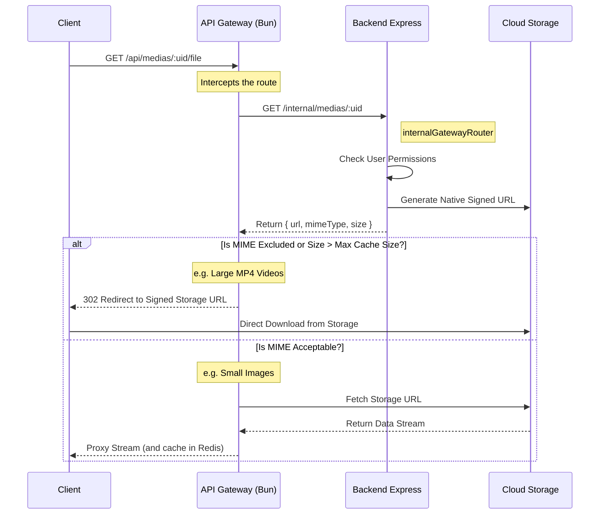

# How To: Using and Understanding the Gateway Router Workflow

This guide details the internal workings of the API Gateway Media Facade and how the `internalGatewayRouter` fits into the broader architecture.

## Overview

The `api-gateway` serves as a front-facing proxy for the TotalYmage platform. Its role is to intercept requests for media, fetch them from the cloud storage (e.g. S3, Supabase, Firebase), and securely stream or cache them. To do this securely without exposing cloud credentials to the proxy, it communicates with the backend API via the `internalGatewayRouter`.

## The "Facade" Workflow

When a client (like a browser) needs to display an image or video, it does not fetch directly from Storage. Instead, it hits the API Gateway. The Gateway determines whether it should stream/cache the content or redirect the user straight to Storage based on file size and MIME type.

Here is the complete sequence of operations:



## How to implement `onResolveMedia`

To correctly interface with the API Gateway, your backend Express app must mount the `internalGatewayRouter`. 
The `onResolveMedia` callback is the core component where you resolve the media's native storage URL.

### 1. The Right Way (Direct Native URLs)

Your callback **must** return the pure, native signed URL (e.g., from your Storage bucket). **Do not** attempt to rewrite this URL to point back to the Gateway, as this will create an infinite loop or cause 403 Forbidden errors.

```typescript
import { createGatewayRouter } from '@quatrain/gateway-upstream-express'
import { Storage } from '@quatrain/storage'

export const internalGatewayRouter = createGatewayRouter({
  secret: process.env.GATEWAY_SECRET,
  onResolveMedia: async (req, uid, action) => {
    // 1. Fetch media document from DB
    const media = await getMediaFromDB(uid)
    
    if (!media) return null

    // 2. Obtain a pure native signed URL from your Storage Adapter
    const { url } = await Storage.getStorage().getUrl(
        media.file, 
        7200,    // 2 hours validity
        'read'
    )

    // 3. Return the payload to the Gateway
    return {
       url,
       mimeType: media.file.contentType || 'application/octet-stream',
       size: media.file.size || 0
    }
  }
})
```

## Security Considerations

- **GATEWAY_SECRET**: The `internalGatewayRouter` completely bypasses standard user authentication (since the proxy does the fetching). It is secured exclusively by the `X-Gateway-Secret` HTTP header. You must ensure `GATEWAY_SECRET` is synchronized between the `api-gateway` environment and your Backend environment.
- **Internal Only**: The `/internal/medias/*` routes should never be exposed to the public web. Ensure your reverse proxy (like Nginx or Traefik) blocks external access to the `/internal` prefix.
